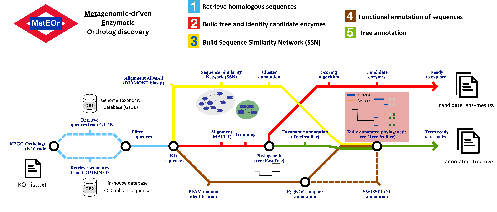

# MetEOr: Metagenomic-driven Enzymatic Ortholog discovery



MetEOr is an innovative pipeline for discovering enzymatic orthologs using metagenomic data. Developed as part of a Master's thesis, this project aims to streamline the identification and analysis of enzymatic orthologs from complex metagenomic datasets.

## 🚀 Features

- Automated processing of metagenomic data
- Identification of enzymatic orthologs
- Network-based analysis of enzyme relationships
- Phylogenetic tree construction and annotation
- Integration with KEGG Orthology (KO) database

## 📁 Repository Structure
- `emap_env.yml`: Conda environment file for eggNOG-mapper dependencies.
- `ete_diamond_env.yml`: Conda environment file for ETE Toolkit and DIAMOND dependencies.
- `KOs_ids.txt`: Input file containing KEGG Orthology (KO) identifiers for analysis.
- `main_script.py`: The primary Python script for the pipeline.
- `bin/`:
  SLURM scripts for job submission in a cluster environment:

  - `KO2fasta.slurm`: Step 1 - Retrieve homologous sequences
  - `treebuilder.slurm`: Step 2 - Build tree and identify candidate enzymes
  - `SSN.slurm`: Step 3 - Build 	Sequence Similarity Networks (SSN)
  - `emapper.slurm`: Step 4 - Functional annotation of sequences
  - `treeannotator.slurm`: Step 5 - Tree annotation
    
  Python scripts launched dependent on SLURM scripts:

  - `build_network.py`: Builds a network for enzymatic ortholog analysis.
  - `build_network_structure.py`: Structures or extends the network built by `build_network.py`.
  - `clean_diamond.py`: Cleans up data using the Diamond tool.
  - `filter_by_length.py`: Filters sequences based on length criteria.
  - `get_seqs_by_ko_hit.py`: Retrieves sequences based on hits to KEGG Orthology (KO).
  - `identify_clusters_net.py`: Identifies clusters within a network context.
  - `identify_clusters_structural.py`: Identifies structural clusters or patterns.
  - `midpoint_tree.py`: Constructs midpoint trees for phylogenetic analysis.
  - `plot_algorithm.py`: Generates plots related to algorithms or data analysis results.
  - `threshold_algorithm.py`: Implements algorithms with specified thresholds.
  - `trim_alignment.py`: Trims sequence alignments.

## 🛠️ Installation

MetEOr is designed to be run in an HPC cluster. Detailed installation instructions will be provided as the project progresses. We plan to implement it in Nextflow or distribute it via a Singularity container.
We give below some initial instructions.

### 0. Check Prerequisites

Before you begin, ensure you have the following:

- Python 3.7+
- SLURM on an HPC (High-Performance Computing) cluster to run the program
- Miniconda (for managing environments)

If you don't have Miniconda installed, follow these steps:

- Download Miniconda installer
```bash
wget https://repo.anaconda.com/miniconda/Miniconda3-latest-Linux-x86_64.sh
```

- Make the installer executable
```
chmod +x Miniconda3-latest-Linux-x86_64.sh
```

- Run the installer
```
./Miniconda3-latest-Linux-x86_64.sh
```

- Restart your terminal or run:
```
source ~/.bashrc
```

- Install mamba for faster environment solving
```
conda install mamba -n base -c conda-forge
```
 
### 1. Clone the Repository

```bash
git clone https://github.com/jacgonisa/MSc_thesis.git
cd MSc_thesis
```

### 2. Set Up Conda Environments
- Create and activate the EggNOG-mapper environment
```
mamba env create -f emap_env.yml
```

- Create the ETE Toolkit and DIAMOND environment
```
mamba env create -f ete_diamond_env.yml
```


## 📘 Usage

Comprehensive usage instructions and examples will be added as the project develops. The pipeline will be designed for ease of use in both local and cluster environments.


To execute `main_script.py`, use the following command in your terminal:

```bash
python main_script.py --min_identity 30 --min_gtdb_seq_cov 30 --min_kegg_seq_cov 30 --database combined --annotation swissprot KO_list.txt
```

- `--min_identity`: Specifies the minimum identity value for sequence similarity. In this example, it is set to `30`. This value determines how similar sequences must be to be retrieved.

- `--min_gtdb_seq_cov`: Sets the minimum sequence coverage from GTDB (Genome Taxonomy Database). It is also set to `30` in this example. Sequence coverage indicates how much of the target sequence is covered by the query sequence.

- `--min_kegg_seq_cov`: Defines the minimum sequence coverage from KEGG (Kyoto Encyclopedia of Genes and Genomes). Similar to the other metrics, it is set to `30`. 

- `--database`: Specifies which database to use for analysis. In this case, `combined` is chosen, indicating a combination or integration of data from GTDB and metagenomic databases. Alternatively, `gtdb` can be specified to use only GTDB data.

- `--annotation`: Defines the annotation method to use during the analysis. Here, `swissprot` is selected, indicating the use of annotations from the Swiss-Prot database. Alternatively, `default` annotations may be applied and would only include eggNOG-mapper annotations.


## 🤝 Contributing

We welcome contributions to MetEOr! Here's how you can help:

1. Fork the repository
2. Create a new branch (`git checkout -b feature/AmazingFeature`)
3. Commit your changes (`git commit -m 'Add some AmazingFeature'`)
4. Push to the branch (`git push origin feature/AmazingFeature`)
5. Open a Pull Request


## 📄 License

This project is licensed under the MIT License. See the [LICENSE](LICENSE) file for details.

## 📞 Contact

For questions, suggestions, or collaborations, please contact:

[jacgonisa](https://github.com/jacgonisa)

---

⚠️ **Note**: This project is under active development. Check back regularly for updates and new features!
